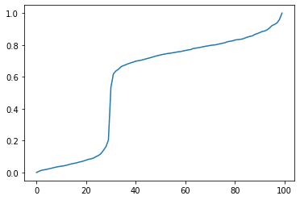

# dist_curve
> Fast Nonparametric Estimation of Class Proportions in the Positive Unlabeled Classification Setting


## Install

`git clone https://github.com/Dzeiberg/dist_curve.git`

`pip install dist_curve`

## Make Curve

```python
import numpy as np
from dist_curve.curve_constructor import makeCurve, plotCurve

alpha = 0.3
posSize = 100
mixSize = 1000
dim = 25
posInstances = np.random.normal(loc=5,scale=2,size=(posSize, dim))

mixInstances = np.concatenate((np.random.normal(loc=1, size=(int(mixSize*(1 - alpha)), dim)),
                               np.random.normal(loc=5,scale=2,size=(int(mixSize * alpha), dim))),
                              axis=0)

curve = makeCurve(posInstances, mixInstances)

plotCurve(curve)
```




