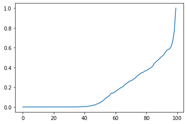

# dist_curve
> Fast Nonparametric Estimation of Class Proportions in the Positive Unlabeled Classification Setting


## Dependencies

Requires CUDA Toolkit to have been set up

## Install

`git clone https://github.com/Dzeiberg/dist_curve.git`

`pip install dist_curve`

## Make Curve

```
import numpy as np
from dist_curve.curve_constructor import makeCurve, plotCurve

alpha = 0.4
posSize = 100
mixSize = 500
dim = 1
posInstances = np.random.normal(loc=1,scale=1,size=(posSize, dim))

mixInstances = np.concatenate((np.random.normal(loc=1, scale=1, size=(int(mixSize*(alpha)), dim)),
                               np.random.normal(loc=3,scale=1,size=(int(mixSize * (1-alpha)), dim))),
                              axis=0)

curve = makeCurve(posInstances, mixInstances,)

plotCurve(curve)
```





# Estimate Class Prior

[Download Model](https://drive.google.com/open?id=1C3-11IXNyB9k7pA-ix1n14tfbeO_oy3N)

```
from dist_curve.model import getTrainedEstimator
```

```
pathToModel = "/data/dzeiberg/ClassPriorEstimation/model.hdf5"
```

```
model = getTrainedEstimator(pathToModel)
```

```
model.predict(curve.reshape((1,-1))/curve.sum())
```


    array([[0.31434005]], dtype=float32)


